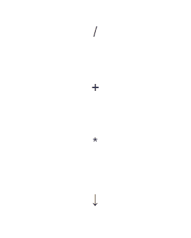

# bytespin
spinner nanocomponent that cycles through a given list of characters ( [**demo**](https://bytespin.netlify.com) )




## installation

`npm install --save bytespin`


## usage 

`spinner = Spinner(opts)`
creates a new Spinner instance. 

```js
{
  chars: string  // characters to cycle through
  speed: number // spinning speed in ms
}
```

## example

```js
var Spinner = require('bytespin')
var spinner = Spinner({ chars: '\\|/-', speed: 125 })

function view (state, emit) {
  return `
    <div>
      ${spinner.render(state.fetching)}
    </div>`
}
```
